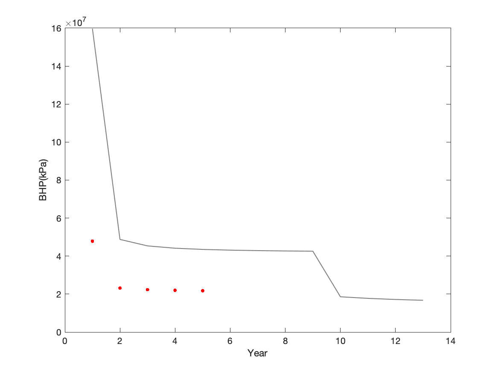
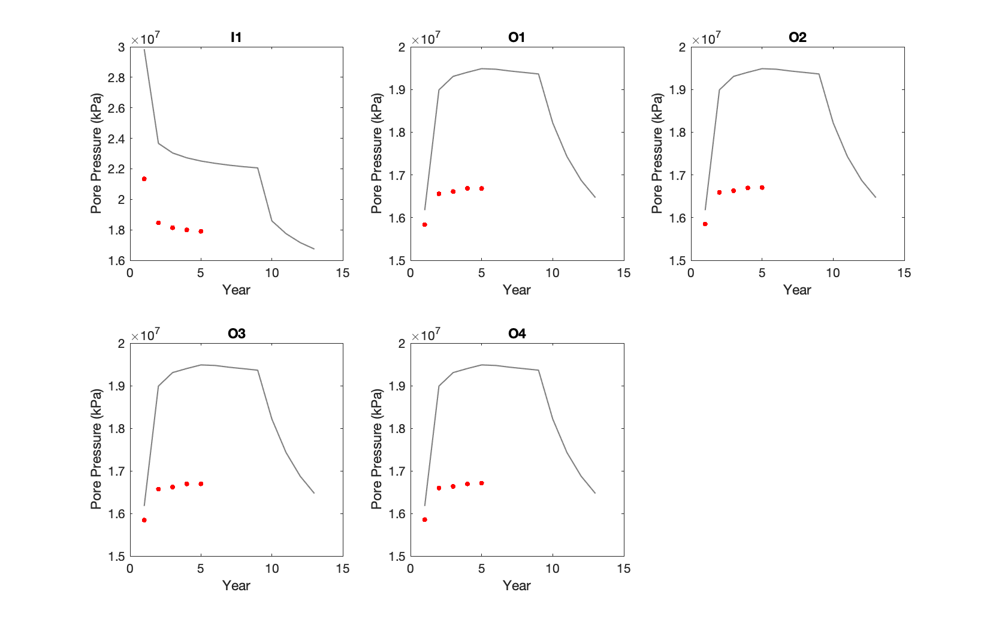
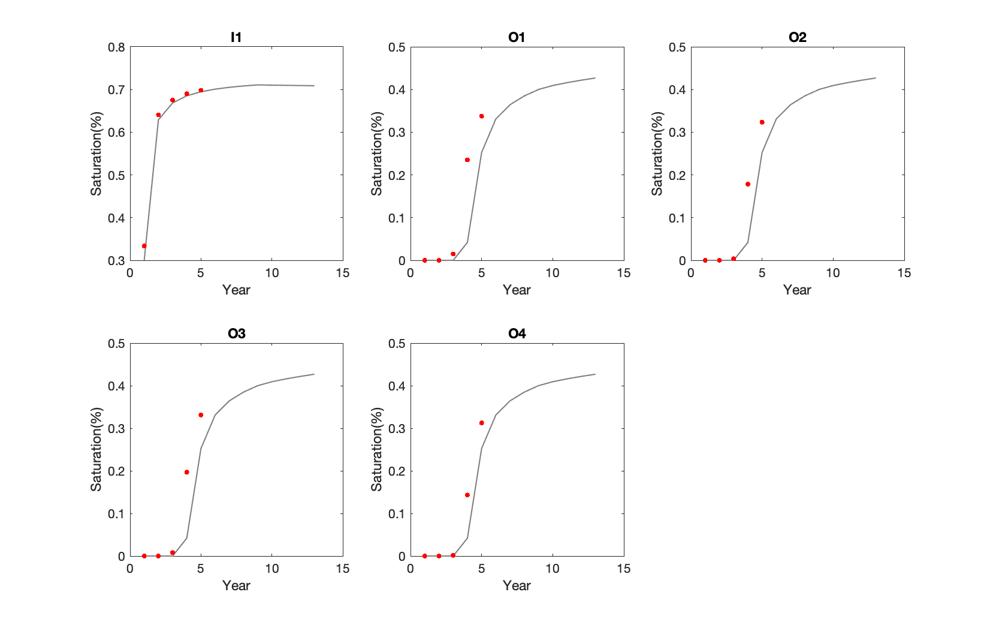
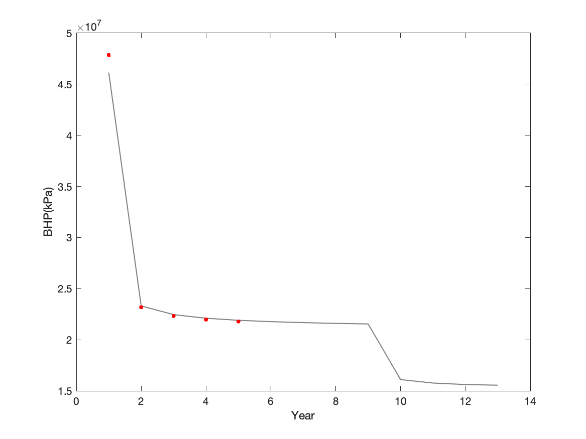
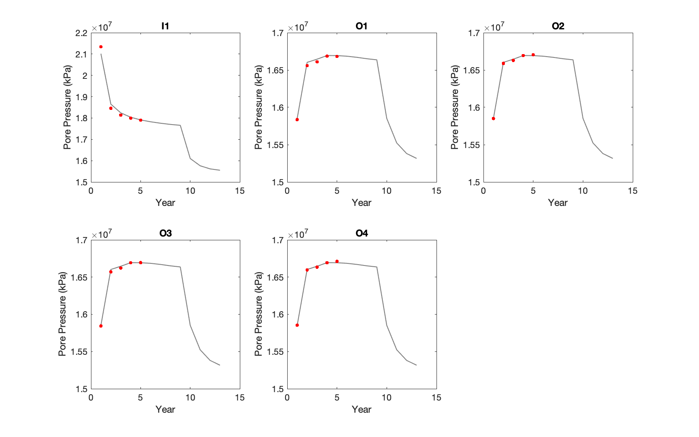
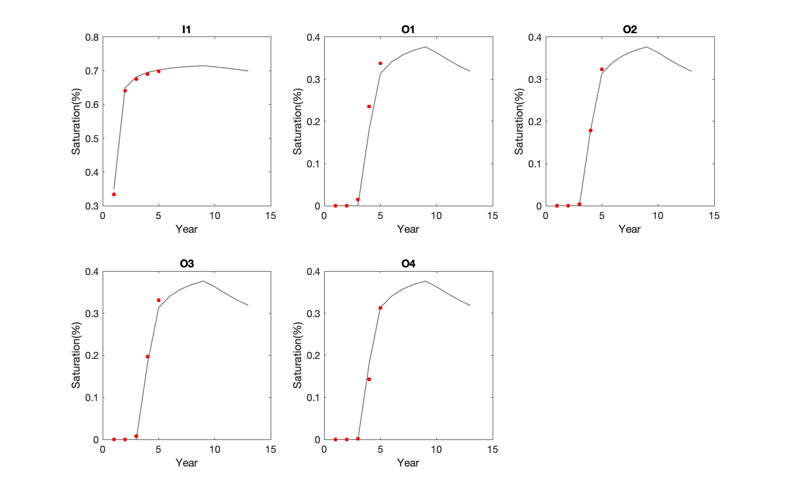

# GEOLOGIC CO₂ STORAGE

## Overview
This project simulates geologic CO₂ storage over a 6-year lifecycle, comprising 4 years of injection and 2 years of post-injection monitoring. The workflow includes **Risk Assessment**, **Model Updating**, and **Optimization**, each involving data-driven simulation and decision-making techniques. A simplified reservoir model divided into 15 homogeneous permeability zones is used throughout. Key challenges addressed include quantifying uncertainty in geological parameters, mitigating CO₂ leakage and fracturing risks, and improving predictive accuracy via model calibration and optimization.

---

## Repository Structure

- **Risk Assessment/**
  - Monte Carlo simulations with 20 permeability realizations generated via Gaussian sampling.
  - Scripts to compute top-layer CO₂ volume (leakage indicator) and maximum reservoir pressure (fracturing risk).
  - Histograms and spatial maps to visualize and quantify uncertainties.

- **Model Updating/**
  - Implements a two-stage history-matching process:
    - **Best Realization Selection** – minimizes mismatch between simulation and observed data.
    - **Permeability Updating** – applies a 15-zone multiplier vector to tune permeability.
  - Visual comparisons of field data vs. simulations (before and after update) for BHP, pore pressure, and saturation.

  **Before**

  | BHP | P-Well | S-Well |
  |:---:|:------:|:------:|
  |  |  |  |

  **After**

  | BHP | P-Well | S-Well |
  |:---:|:------:|:------:|
  |  |  |  |

- **Optimization/**
  - Includes:
    - **Well Placement Optimization**: Brute-force search over at least 10 possible two-well configurations.
      
      
    - **Injection Rate Optimization**: Dynamic adjustment under fixed total injection volume (1 Mt/year).
      
      
  - Goal: Simultaneously minimize top-layer CO₂ volume and max pressure while maintaining injection goals.
 
- **Utils/**
  - Utility scripts and wrappers for plotting, loading `.mat` files, running MRST-based simulations, and saving results.

---

## Key Methodologies and Algorithms

### Risk Assessment

- **Realization Generation**

  For each of the 15 permeability zones:

$$
\log_{10}(k_i) \sim \mathcal{N}(\mu, \sigma^2)
$$

  where  $k_i$ is the permeability of zone `i`.  
  Twenty realizations form a 15×20 matrix stored as `perm_all.mat`.

- **Leakage & Fracture Metrics**

  - **Leakage potential** ∝ CO₂ volume in the first (top) layer.
  - **Fracture risk** ∝ maximum pressure in the reservoir.

  Both metrics are visualized via histograms and stored as `co2_volume_all` and `max_pressure_all`.

---

### Model Updating

- **Mismatch Metric**

  Mismatch is computed using the L₂ norm or average absolute error:

$$
\text{Mismatch} = \frac{1}{N} \sum_{t=1}^{N} \left|\ x_t^{\text{sim}} - x_t^{\text{obs}}\right|
$$

  
  where  
  • $x_t^{sim}$ – simulated value (BHP, pressure, or saturation)  
  • $x_t^{obs}$ – observed value at timestep `t`

- **Permeability Tuning**

  Updated permeability is calculated by:

$$
\mathbf{k}^{\text{updated}} = \mathbf{k}^{\text{best}} \circ \boldsymbol{\alpha}
$$

  where:
- $\circ$ denotes element-wise multiplication  
- $\boldsymbol{\alpha} \in \mathbb{R}^{15}$ is the zone-wise multiplier vector

---

### Optimization

- **Well Relocation**
  - Minimum 8 grid-block spacing between the two injection wells.
  - Simulate at least 10 different well placements.
  - Evaluate risk metrics (CO₂ leakage and max pressure).
  - Visualize CO₂ plume migration and well locations in 3D.

- **Injection Rate Allocation**
  - Total injection rate is fixed at 1 Mt/year.
  - Dynamically reallocate between the two wells to reduce risks.
  - Save and plot:
    - Time-varying injection rates
    - Time-varying risk values (top-layer CO₂ volume and max pressure)

---

## Conclusion

This project provides a structured approach to managing uncertainty and optimizing performance in geologic CO₂ storage. The 15-zone simplification balances realism and tractability. Probabilistic simulations help identify potential leakage and fracturing risks, while history-matching techniques enable model calibration. Well placement and injection rate optimization show how to mitigate trade-offs between competing risks. Overall, this framework supports safe, efficient, and data-informed CO₂ sequestration strategies.
