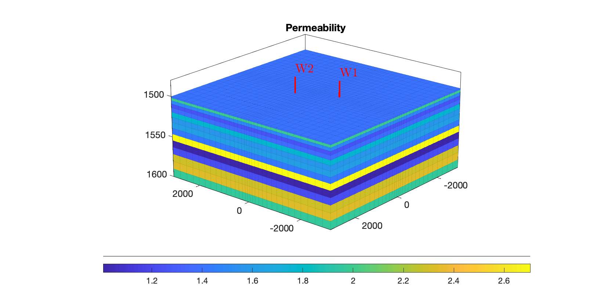
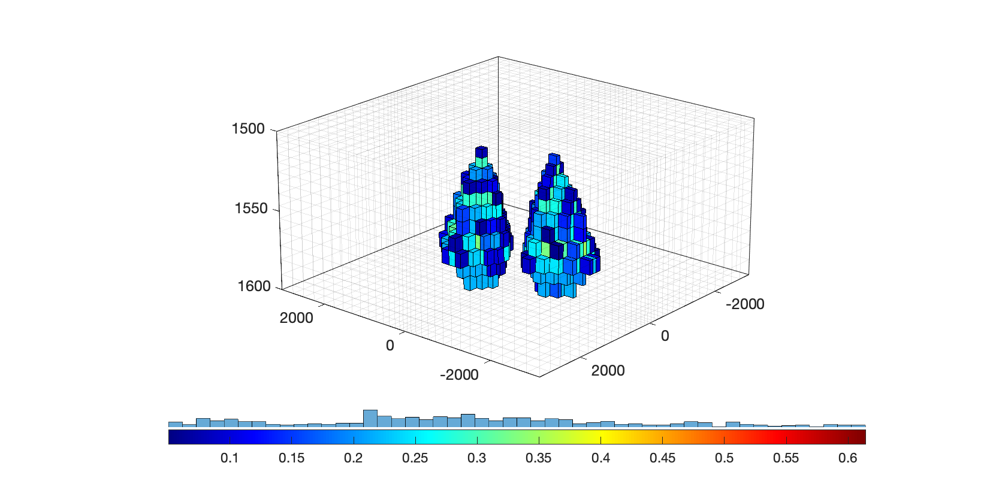

# 🏔️ GEOLOGIC CO₂ STORAGE  
Six-year simulation • Risk assessment • History matching • Optimization

---

## 📑 Table of Contents
1. [Overview](#overview)
2. [Repository Structure](#repository-structure)
3. [Key Methodologies](#key-methodologies)
   - [Risk Assessment](#risk-assessment)
   - [Model Updating](#model-updating)
   - [Optimization](#optimization)
4. [Conclusion](#conclusion)

---

## 🌍 Overview
This project simulates **geologic CO₂ storage** over a six-year life-cycle  
(4 yr injection ➜ 2 yr post-injection monitoring).  
The workflow integrates

| Stage | Purpose | Highlights |
|-------|---------|------------|
| **Risk Assessment** | Quantify leakage & fracturing risks | 20 permeability realizations, uncertainty histograms |
| **Model Updating** | Calibrate model to field data | Two-stage history matching, 15-zone multipliers |
| **Optimization** | Improve storage performance | Well placement & injection-rate scheduling |

A simplified reservoir model with **15 homogeneous permeability zones** underpins all simulations.  
Key challenges addressed: uncertainty quantification, risk mitigation, and predictive-accuracy enhancement.

---

## 🗂️ Repository Structure

GEOLOGIC_CO2_STORAGE/
├── Risk Assessment/ # Probabilistic leakage / pressure analysis
├── Model Updating/ # Two-stage history matching
├── Optimization/ # Well & rate optimisation scripts
├── Utils/ # MRST helpers, plotting, I/O
└── ...

| Folder | Core Content |
|--------|--------------|
| **Risk Assessment/** | • 20 Monte-Carlo permeability realizations • CO₂-volume & pressure metrics • Uncertainty visualisation |
| **Model Updating/**  | • Best-realization selection • 15-zone permeability multipliers • Before/after BHP & saturation plots |
| **Optimization/**    | • Brute-force two-well placement search (≥10 configs) • Dynamic rate allocation (1 Mt yr⁻¹ total) • Trade-off analysis |
| **Utils/**           | Plotting, `.mat` loaders, MRST wrappers |

---

## 🔬 Key Methodologies

### Risk Assessment
1. **Permeability Realizations**  
   $$\log_{10}(k_i)\sim\mathcal N(\mu,\sigma^2),\qquad i=1,\dots,15$$  
   Stored in `perm_all.mat` (shape 15 × 20).

2. **Risk Metrics**  
   | Metric | Proxy | File |
   |--------|-------|------|
   | Leakage potential | CO₂ volume in top layer | `co2_volume_all.mat` |
   | Fracture risk | Maximum reservoir pressure | `max_pressure_all.mat` |

### Model Updating
* **Mismatch** (per timestep \(t\))  
  $$\text{Mismatch}=\frac1N\sum_{t=1}^{N}\lvert x_t^{\text{sim}}-x_t^{\text{obs}}\rvert$$

* **Permeability Tuning**  
  $$\mathbf k^{\text{updated}}=\mathbf k^{\text{best}}\circ\boldsymbol\alpha,\qquad
  \boldsymbol\alpha\in\mathbb R^{15}$$

| **Before** | | |
|:--:|:--:|:--:|
|  |  |  |

| **After** | | |
|:--:|:--:|:--:|
|  |  |  |

### Optimization

#### 🚩 Well Placement Optimization
<table>
  <tr>
    <td align="center"></td>
    <td align="center"></td>
  </tr>
  <tr>
    <td align="center"><em>Permeability map & new wells</em></td>
    <td align="center"><em>CO₂ plume (top view)</em></td>
  </tr>
</table>

#### 💧 Injection Rate Optimization
<table>
  <tr>
    <td align="center"></td>
    <td align="center"></td>
  </tr>
  <tr>
    <td align="center"><em>Rate allocation</em></td>
    <td align="center"><em>Leakage-risk trajectory</em></td>
  </tr>
</table>

---

## 🏁 Conclusion
This framework offers a **data-informed, end-to-end workflow** for safe and efficient CO₂ sequestration:

* **Uncertainty-aware risk screening** pinpoints leakage & fracturing hotspots.  
* **History matching** narrows model uncertainty via zone-wise permeability tuning.  
* **Dual-objective optimisation** balances injection efficiency against environmental risk.

> **Takeaway:** Integrating probabilistic simulations with adaptive optimisation markedly enhances predictive reliability and operational safety in geologic CO₂ storage projects.

---

*Made with ❤️ & MRST.*
